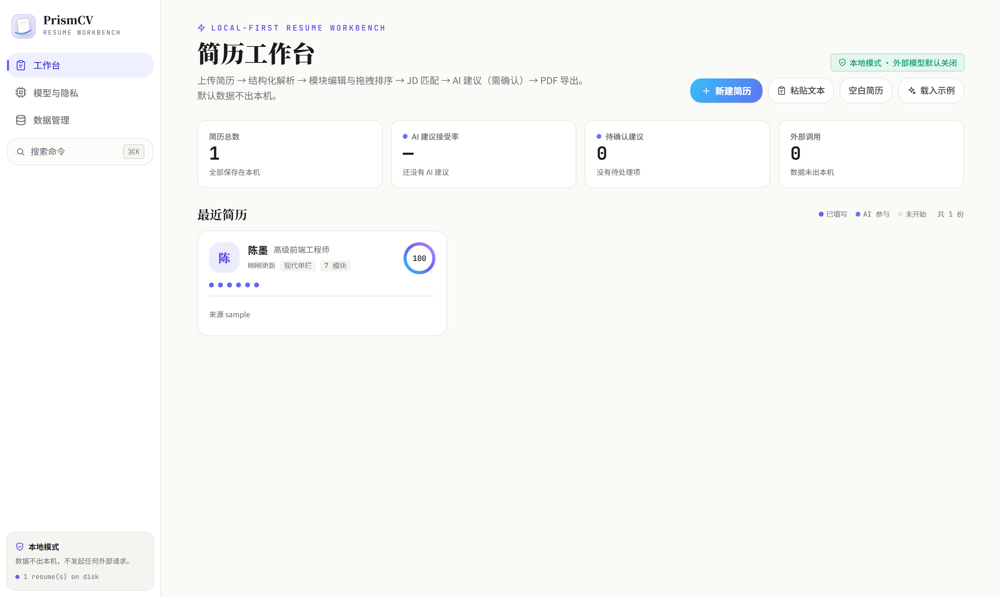
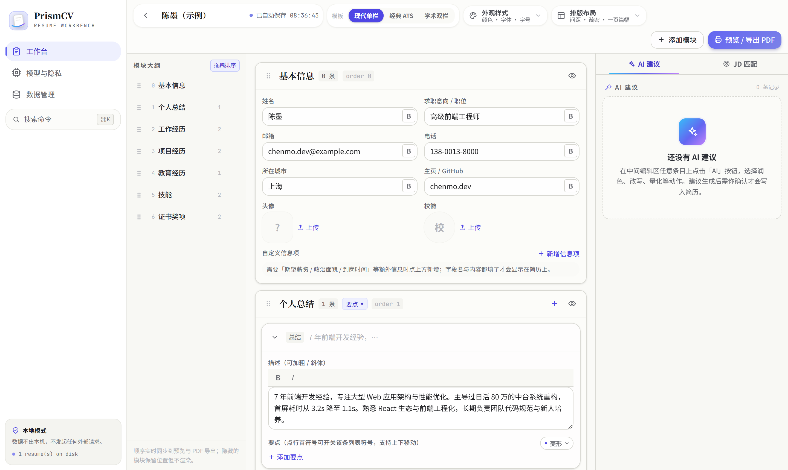

# PrismCV — AI Resume Workbench · 本地 AI 简历工作台

[](LICENSE)
[](https://react.dev)
[](https://www.typescriptlang.org)
[](https://vite.dev)
[](#隐私与安全)

> **Local-first · Privacy by default · Human-in-the-loop AI · Data-driven editing**
> 本地优先 · 隐私默认保护 · 用户可控 · AI 辅助而非自动覆盖 · 结构化数据驱动

**PrismCV** is a local-first, AI-assisted resume workbench that runs entirely in your browser. Upload an existing resume — PDF / DOCX / MD / TXT — and it is parsed into structured data; edit module by module, drag to reorder, paste a **job description** to get a local matching analysis, and ask AI for per-section suggestions that are always shown as a diff before you accept them. Export a pixel-faithful A4 PDF through the system print pipeline. **No data leaves your machine by default**; external models must be explicitly enabled and confirmed per call.

The name is a pun on optics: a resume is a *prism* that splits your career into the spectrum a role is looking for — the same tricolor spectrum (`#38BDF8 → #6366F1 → #C084FC`) used across the UI's AI accents.

<p align="center">
  <a href="https://beta-zheng.github.io/PrismCV/"></a>
</p>

<p align="center">
  
  &nbsp;
  
</p>

---

## English quick start

```bash
npm install
npm run dev           # dev mode → http://localhost:3000
npm run build         # production build → dist/
npm run typecheck     # TypeScript check
npm test              # unit tests (parser / jd / ai / utils / flows)
```

Requirements: Node.js ≥ 18. Optional: a local [Ollama](https://ollama.com) to enable on-device model suggestions.

### Live demo

无需 clone，直接体验：👉 **https://beta-zheng.github.io/PrismCV/**
每次 `git push` 到 `master` 后由 GitHub Actions 自动重新构建并部署。

### Highlights

- **Local-first by default** — no uploads, no telemetry, no account; models are opt-in only.
- **Parse, don't retype** — import PDF / DOCX / MD / TXT and get structured resume data back.
- **A4 WYSIWYG editing** — three templates, drag-and-drop module ordering, live A4 preview.
- **JD matching** — paste a job description; a local rule engine scores fit and lists missing skills & keywords.
- **Human-in-the-loop AI** — seven per-block actions; every suggestion appears as a diff before applying.
- **Print-perfect export** — system print pipeline → PDF, honoring template / theme / typography exactly.

### Templates

| Template | Description |
|---|---|
| Modern | 现代单栏：serif name + themed section rules + icon badges |
| Classic ATS | 经典黑白：standard headings, plain-text skills — built for parser-first screening |
| Academic | 学术双栏：photo header, circular icon badges — suits graduates & academia |

> Full Chinese documentation below. 中文完整文档如下。

---

## 使用指南

### 1. 创建简历（三种方式）

- **上传文件**：拖拽或点击选择 `.pdf / .docx / .md / .txt`（≤10MB）；
- **粘贴文本**：解析失败时自动切换到此页签，也可直接粘贴简历全文；
- **空白/示例**：完全手动，或载入内置示例简历体验全流程。

> 扫描件 PDF 无可提取文本时会明确提示，并引导改用粘贴方式。

### 2. 编辑器

- **左栏 · 模块大纲**：拖拽调整模块顺序、开关显隐、添加自定义模块；
- **中栏 · 编辑区**：每个模块卡片支持整卡拖拽排序、Block 增删、上移/下移、显隐；描述与要点支持选中加粗/斜体；所有字段即时编辑；
- **右栏 · AI 与 JD 面板**；
- **自动保存**：停止输入约 1 秒后写入本地，顶栏显示保存时间戳。

### 3. 模块拖拽排序

左侧大纲与编辑区拖拽手柄均可调整 Section 顺序，松手即按 `order` 升序持久化；隐藏模块保留位置；重新打开、切换模板、导出 PDF 均与编辑器顺序一致。

### 4. 配置模型

「模型与隐私」页预置本地 Ollama 配置。启动 Ollama 并 `ollama pull qwen2.5:7b` 后点「测试」即可验证；也可新增 OpenAI Compatible 外部模型。**外部模型默认关闭**，开启后每次外部调用前弹窗确认。

### 5. 导出 PDF

编辑器「预览 / 导出 PDF」→ 选择缩放浏览 A4 效果 → 「打印 / 另存为 PDF」调用系统打印面板，目标选「另存为 PDF」。

---

## 隐私与安全

- 默认不上传任何数据、不发遥测、不请求外部服务；
- 外部模型必须显式开启，调用前逐次确认；
- API Key 界面掩码展示，不写入备份与日志；
- 富文本渲染前经白名单消毒（`sanitizeInline`），防注入；
- 解析失败、AI 失败、导出失败均有兜底，不丢失用户已编辑内容。

---


## 名称由来

**Prism**（棱镜）——一束白光穿过棱镜，被分成一条光谱，正如界面里那道 AI 光谱（`#38BDF8 → #6366F1 → #C084FC`）。简历也是一块棱镜：把真实的你，折射成机会想看到的样子。**CV** 直抒品类。


## Contributing

Issues & PRs welcome. 代码约定：模块与 store 层保持纯净（`lib/` 不与 UI 主题耦合），改动请同步跑 `npm run typecheck && npm test`。
